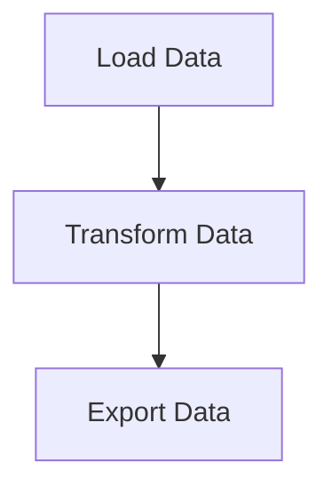

# 📋 Información sobre el fichero `docker-compose.yml`

## 🤔 ¿Qué es este fichero?

Este fichero no es más que la plantilla que considero necesaria como para poder
desplegar la herramienta de Mage AI junto con los escenarios requeridos para el TFG propuesto. En él,
se definen una serie de servicios que se "comunican" a través de una red (_network_).

## 🗣️ Explicación del Fichero `docker-compose.yml`

* **Versión de Docker Compose**: `3.8`
  - Especifica la versión de Docker Compose utilizada.

* **Servicios Definidos**
  * Servicio PostgreSQL. Usa la imagen de PostgreSQL versión 13 basada en Alpine Linux 3.17.
    - El contenedor se nombra como `postgres-db`.
    - El contenedor se reiniciará automáticamente si se detiene `always`.
    - Utiliza el contenedor `./postgres/pgdata:/var/lib/postgresql/data`
    - Persistencia de datos de PostgreSQL en `./postgres/pgdata`.
    - `./postgres/init-magedb.sh:/docker-entrypoint-initdb.d/init-magedb.sh`
    - _Script_ personalizado para inicializar la base de datos.
    - El puerto 5432 del contenedor se mapea al puerto 5432 del _host_ como `5432:5432`.
    - Se hace uso de las variables de entorno `POSTGRES_USER`, `POSTGRES_PASSWORD`, `POSTGRES_DB`
      para configurar los credenciales y la base de datos por defecto.
      
  * Servicio Mage AI. Usa la imagen `mageai/mageai:latest` que es la última versión de Mage AI.
    - El contenedor se nombra como `mage-ai`.
    - El contenedor se reinicia hasta 5 veces si falla `on-failure:5`.
    - Hace uso del comando `"/app/run_app.sh mage start demo"` para ejecutar el _script_ que inicializa Mage AI en modo _demo_.
    - El volumen `./workspace/demo:/home/src` mapea el directorio de trabajo para la persistencia de datos.
    - El puerto 6789 del contenedor se mapea al puerto 6789 del _host_ como `6789:6789`.
    - Se hace uso de la variable de entorno `MAGE_DATABASE_CONNECTION_URL` que define la URL de conexión a la base de datos
      PostgreSQL.

  * **Redes**. La red predeterminada es `mage` que se utiliza como una red externa de conexión entre los dos servicios definidos
  con anterioridad.

## 🧙‍♂️ Introducción a Mage AI

Mage es una herramienta de _data pipeline_ de código abierto para transformar e integrar datos.

1. [Instalación](###-instalacion)
1. [Features](###-caracteristicas)
1. [Principios de Diseño](###-principios-de-diseño)
1. [Abstracciones Básicas](###-abstracciones-basicas)

### 🏃‍♂️ Instalación

La forma recomendada de instalar la última versión de Mage es a través de Docker con el siguiente comando:

```bash
docker pull mageai/mageai:latest
```
En caso de duda, siempre puedes mirar la documentación [aquí](https://docs.mage.ai/getting-started/setup).

### 🔮 Características

|   |   |   |
| --- | --- | --- |
| 🎶 | Orquestación | Programar y administrar _pipelines_ de datos con observabilidad. |
| 📓 | Cuaderno o _Notebook_ | Editor interactivo de Python, SQL y R para codificar _pipelines_ de datos. |
| 🏗️ | Integración de Datos | Sincronizar datos de fuentes de terceros con sus destinos internos. |
| 🚰 | _Streaming Pipelines_ | Ingerir y transformar datos en tiempo real. |
| ❎ | DBT | Crear, ejecutar y administrar sus modelos dbt con Mage. |

Un ejemplo sencillo de _data pipelines_ puede quedar definido en 3 sencillos archivos (o plantillas), lo que indica un potencial procedimiento de 
buenas prácticas en lo que se refiere a la construcción de _pipelines_ de datos:

1. Cargar datos:
    ```python
    @data_loader
    def load_csv_from_file():
        return pd.read_csv('default_repo/titanic.csv')
    ```
2. Transformar datos:
    ```python
    @transformer
    def select_columns_from_df(df, *args):
        return df[['Age', 'Fare', 'Survived']]
    ```
3. Exportar datos ➝
    ```python
    @data_exporter
    def export_titanic_data_to_disk(df) -> None:
        df.to_csv('default_repo/titanic_transformed.csv')
    ```




### 🏔️ Principios de Diseño

Cada experiencia de usuario y decisión de diseño técnico se adhiere a estos principios que además justifican la elección de Mage AI como herramienta para ejemplificar la construcción de _data pipelines_:

|  ID | Principio  |  Descripción |
| --- | --- | --- |
| 💻 | Experiencia Sencilla de Usuario | Motor de código abierto que viene con una interfaz de usuario personalizada para crear _data pipelines_. |
| 🚢 | Mejores prácticas de ingeniería integradas | Crear e implementar _data pipelines_ utilizando código modular. |
| 💳 | Los datos como un ciudadano de primera clase | Diseñado desde cero específicamente para ejecutar flujos de trabajo con uso intensivo de datos. |
| 🪐 | El escalado se simplifica | Analizar y procesar grandes datos rápidamente para una iteración rápida. |

### 🛸 Abstracciones Básicas

Estos son los conceptos fundamentales que utiliza Mage para operar.

| Abstracción  |  Descripción |
| --- | --- |
| Proyecto | Como un repositorio en GitHub; aquí es donde escribes todo tu código. |
| _Pipeline_ | Contiene referencias a todos los bloques de código que desea ejecutar, gráficos para visualizar datos y organiza la dependencia entre cada bloque de código. |
| Bloques | Un archivo con código que se puede ejecutar de forma independiente o dentro de una canalización. |
| Producto de Datos | Cada bloque produce datos después de su ejecución. Estos se denominan productos de datos en Mage. |
| _Trigger_ | Un conjunto de instrucciones que determinan cuándo y cómo se debe ejecutar una canalización. |
| _Run_ | Almacena información sobre cuándo se inició, su estado, cuándo se completó, cualquier variable de tiempo de ejecución utilizada en la ejecución de la canalización o bloque, etc. | 


