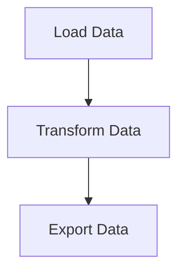

# 🧙‍♂️ Introducción a Mage AI

Mage es una herramienta de _data pipeline_ de código abierto para transformar e integrar datos.

1. [Instalación](#%EF%B8%8F-instalación)
1. [Características](#-características)
1. [Principios de Diseño](#%EF%B8%8F-principios-de-diseño)
1. [Abstracciones Básicas](#-abstracciones-básicas)

## 🏃‍♂️ Instalación

La forma recomendada de instalar la última versión de Mage es a través de Docker con el siguiente comando:

```bash
docker pull mageai/mageai:latest
```
En caso de duda, siempre puedes mirar la documentación [aquí](https://docs.mage.ai/getting-started/setup).

## 🔮 Características

|   |   |   |
| --- | --- | --- |
| 🎶 | Orquestación | Programar y administrar _pipelines_ de datos con observabilidad. |
| 📓 | Cuaderno o _Notebook_ | Editor interactivo de Python, SQL y R para codificar _pipelines_ de datos. |
| 🏗️ | Integración de Datos | Sincronizar datos de fuentes de terceros con sus destinos internos. |
| 🚰 | _Streaming Pipelines_ | Ingerir y transformar datos en tiempo real. |
| ❎ | DBT | Crear, ejecutar y administrar sus modelos dbt con Mage. |

Un ejemplo sencillo de _data pipelines_ puede quedar definido en 3 sencillos archivos (o plantillas), lo que indica un potencial procedimiento de 
buenas prácticas en lo que se refiere a la construcción de _pipelines_ de datos:

1. Cargar datos:
    ```python
    @data_loader
    def load_csv_from_file():
        return pd.read_csv('default_repo/titanic.csv')
    ```
2. Transformar datos:
    ```python
    @transformer
    def select_columns_from_df(df, *args):
        return df[['Age', 'Fare', 'Survived']]
    ```
3. Exportar datos ➝
    ```python
    @data_exporter
    def export_titanic_data_to_disk(df) -> None:
        df.to_csv('default_repo/titanic_transformed.csv')
    ```




## 🏔️ Principios de Diseño

Cada experiencia de usuario y decisión de diseño técnico se adhiere a estos principios que además justifican la elección de Mage AI como herramienta para ejemplificar la construcción de _data pipelines_:

|  ID | Principio  |  Descripción |
| --- | --- | --- |
| 💻 | Experiencia Sencilla de Usuario | Motor de código abierto que viene con una interfaz de usuario personalizada para crear _data pipelines_. |
| 🚢 | Mejores prácticas de ingeniería integradas | Crear e implementar _data pipelines_ utilizando código modular. |
| 💳 | Los datos como un ciudadano de primera clase | Diseñado desde cero específicamente para ejecutar flujos de trabajo con uso intensivo de datos. |
| 🪐 | El escalado se simplifica | Analizar y procesar grandes datos rápidamente para una iteración rápida. |

## 🛸 Abstracciones Básicas

Estos son los conceptos fundamentales que utiliza Mage para operar.

| Abstracción  |  Descripción |
| --- | --- |
| Proyecto | Como un repositorio en GitHub; aquí es donde escribes todo tu código. |
| _Pipeline_ | Contiene referencias a todos los bloques de código que desea ejecutar, gráficos para visualizar datos y organiza la dependencia entre cada bloque de código. |
| Bloques | Un archivo con código que se puede ejecutar de forma independiente o dentro de una canalización. |
| Producto de Datos | Cada bloque produce datos después de su ejecución. Estos se denominan productos de datos en Mage. |
| _Trigger_ | Un conjunto de instrucciones que determinan cuándo y cómo se debe ejecutar una canalización. |
| _Run_ | Almacena información sobre cuándo se inició, su estado, cuándo se completó, cualquier variable de tiempo de ejecución utilizada en la ejecución de la canalización o bloque, etc. | 
